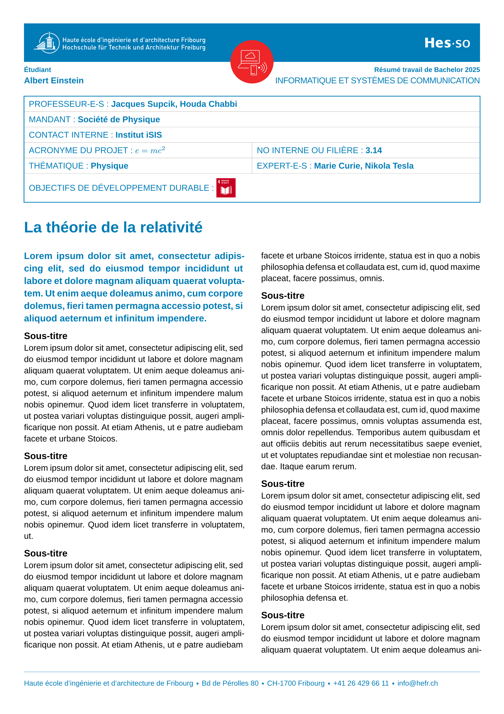

# HEIA-FR Bachelor Flyer

`heiafr-flyer-tb` is a [Typst](https://typst.app/) template for generating bachelor flyer documents for HEIA-FR.

## Installation

This package is not yet published in the Typst _Universe_, but you can easily install it using
the [`utpm`](https://github.com/typst-community/utpm) command line tool.

You can install it directly from GitHub:

```bash
utpm pkg install https://github.com/hes-so/HEIAFR-flyer-tb-template.git
```

## Usage

### Initialise a new project

Use the Typst template to scaffold a new project:

```bash
typst init @local/heiafr-flyer-tb my-flyer
cd my-flyer
```

This creates the following structure:

```
main.typ          # entry point for the definition of questions
profs.typ         # definition of professors
```

### Edit the flyer

Edit the `main.typ` file to define the flyer content, including the title, date, and other relevant information.

### Compile the flyer

```bash
# Student version (no solutions)
typst compile main.typ
```

## Package information

| Field   | Value                                     |
|---------|-------------------------------------------|
| Name    | `eiafr-flyer-tb`                          |
| Version | `0.1.2`                                   |
| License | MIT                                       |
| Author  | Jacques Supcik <jacques.supcik@hes-so.ch> |

## License

This project is licensed under the [MIT License](LICENSE).

## Example Output


